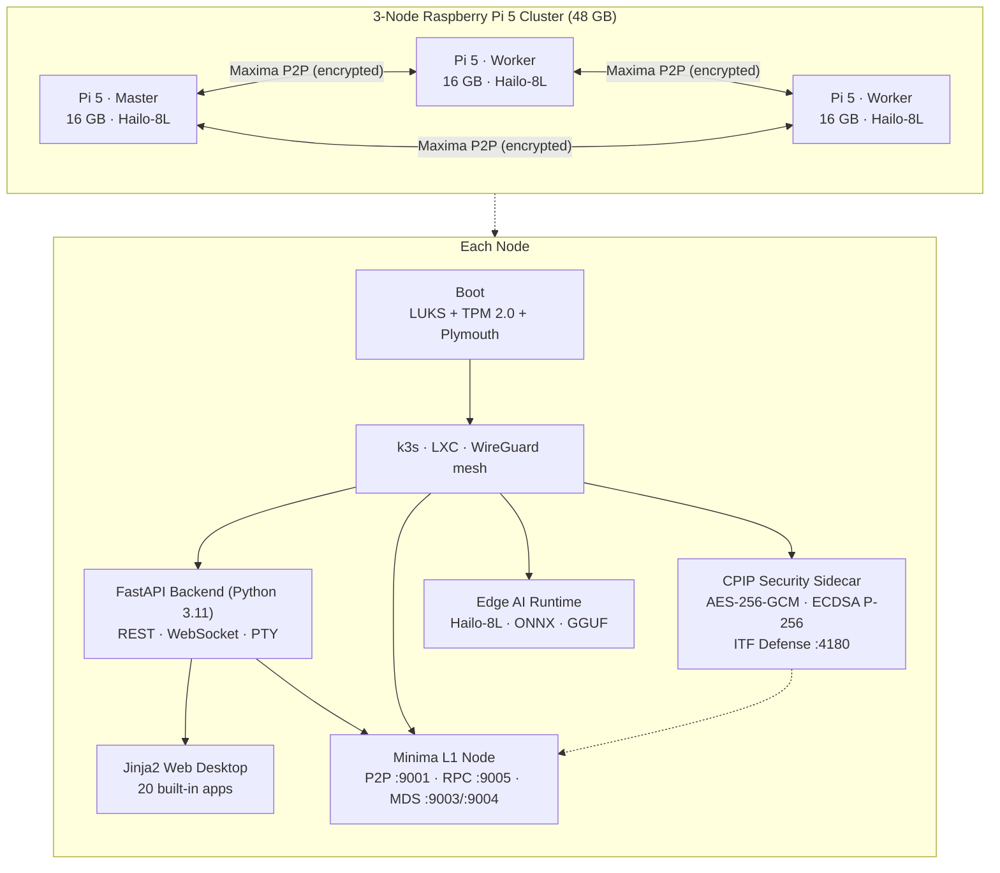

# Minima‑PiNet‑OS

> **A zero‑bloat, blockchain‑native operating system that turns a $80 Raspberry Pi into a self‑sovereign edge cloud — secure by construction, decentralised by design, AI‑accelerated out of the box.**

[](LICENSE)
[](#hardware)
[](#technology-stack)
[](https://www.minima.global/)
[](https://github.com/WilliamMajanja/CPIP-)
[](RELEASE_NOTES.md)
[](https://github.com/WilliamMajanja/Minima-PiNet-Os/actions/workflows/arm64-build.yml)

---

## The Pitch

Centralised cloud has a structural problem: every workload, every identity, and every byte of data flows through a handful of US hyperscalers. That is bad for **cost**, bad for **privacy**, bad for **sovereignty**, and increasingly bad for **regulation**.

**Minima‑PiNet‑OS** flips that model. A single Raspberry Pi 5 — booted from one flashable image — becomes:

- a **full Layer‑1 blockchain node** (Minima) carrying its own identity and trust,
- a **k3s edge cluster** that runs containerised workloads,
- a **local AI accelerator** (Hailo‑8L NPU, 13 TOPS) for on‑device LLM and vision inference,
- a **zero‑trust mesh participant** (WireGuard + LUKS + TPM‑sealed keys + CPIP security provider),
- and a **browser‑accessible desktop OS** with 20 built‑in management apps.

Three Pis form a 48 GB self‑healing cluster. Thirty Pis form a regional decentralised cloud. **No central API server. No cloud account. No vendor lock‑in.**

---

## Why Now

| Driver | What changed | Why it matters for PiNet‑OS |
|---|---|---|
| **Edge AI economics** | $70 Hailo‑8L NPUs deliver 13 TOPS at 2 W | On‑device LLMs and vision are now cheaper than cloud inference |
| **Data sovereignty regulation** | EU AI Act, India DPDP, UK Data Bill | Enterprises need infrastructure that **cannot** exfiltrate data |
| **Web3 maturity** | Minima L1 runs a full node in <500 MB | True decentralisation no longer requires a datacentre |
| **Raspberry Pi 5** | 16 GB RAM, PCIe Gen 3, gigabit Ethernet | First Pi credible as a production server, not a hobby board |

The intersection of these four trends did not exist 18 months ago. **PiNet‑OS is the first OS purpose‑built for it.**

---

## Key Differentiators

1. **One image, one boot, one cluster.** Flash, power on, and a 256 MB image (64 MB FAT32 boot + 192 MB ext4 rootfs) self‑provisions on first boot — SSH keys, user, services, blockchain identity.
2. **Decentralised control plane.** Cluster coordination runs over Minima's encrypted **Maxima** P2P bus. There is **no central API server to compromise or pay for**.
3. **Zero‑trust by default.** LUKS full‑disk encryption with TPM 2.0 sealing, WireGuard‑only inter‑container traffic, blockchain‑anchored remote attestation, fail2ban, NetworkPolicy default‑deny, **CPIP security provider** (AES‑256‑GCM, ECDSA P‑256, HMAC‑SHA256 RPC auth, ITF Defense probe blocking).
4. **AI without the cloud.** Hailo‑8L NPU passthrough into LXC; ARM NEON / GGUF 4‑bit fallback on Pi 4; deterministic latency via cgroup CPU pinning.
5. **A real OS, not a demo.** 20 built‑in desktop apps (terminal, system monitor, cluster manager, wallet, Maxima messenger, DApp store, AI assistant, …) over a single Python (FastAPI + Jinja) stack — auditable, type‑checked, no SPA build chain.
6. **DApp platform built in.** Three DApp kinds (`typescript`, `python-dashboard`, `minidapp`) install via signed manifest into a sandboxed iframe with a permissioned bridge to OS APIs.

---

## Architecture at a Glance



A more detailed view lives in **[wiki/Architecture.md](wiki/Architecture.md)** and **[PiNetOS/ARCHITECTURE.md](PiNetOS/ARCHITECTURE.md)**.

---

## Hardware

| Component | Minimum | Reference Platform |
|---|---|---|
| Compute | Raspberry Pi 4 (4 GB) | **Raspberry Pi 5 (16 GB)** ×3 |
| AI accelerator | ARM NEON (CPU) | **Hailo‑8L NPU (13 TOPS)** |
| Storage | 16 GB microSD | 128 GB NVMe SSD (PCIe Gen 3) |
| Network | Gigabit Ethernet | Gigabit Ethernet + WireGuard mesh |
| Power | 27 W USB‑C PD | 27 W USB‑C PD ×3 (≈ 15 W idle / node) |

**A reference 3‑node cluster costs under USD 1,500 fully assembled.** For comparison, the equivalent always‑on workload on a major hyperscaler exceeds that figure in **monthly** spend.

---

## Technology Stack

| Layer | Technology |
|---|---|
| Web server | **FastAPI** (Python 3.11+) — async, typed, auto‑documented |
| Frontend | **Jinja2** templates + vanilla JS/CSS — no SPA build chain, no supply‑chain bloat |
| Blockchain | **Minima** L1 (Java) — full node in <500 MB |
| P2P bus | **Maxima** — Minima's end‑to‑end encrypted message protocol |
| State verification | **RMP + RNPE-2** — compressed state proofs and peer exchange for missing block validation |
| Security provider | **CPIP** (The Coffee Protocol v4.0.2) — AES‑256‑GCM (FIPS 197), ECDSA/ECDH P‑256 (FIPS 186‑4), RSA‑KEM‑2048, HMAC‑SHA256, optional 1nf1D3L Kyber PQ KEM, ITF Defense, FIPS 140‑2/3 self‑tests |
| Cluster orchestration | **k3s** (lightweight Kubernetes) + Go cluster manager |
| Workload isolation | **LXC** with GPU/NPU passthrough |
| Storage | **IPFS** (content‑addressed, blockchain‑anchored) |
| Networking | **WireGuard** mesh + nftables + fail2ban |
| Disk encryption | **LUKS2** with **TPM 2.0** key sealing |
| AI runtimes | TensorFlow Lite · ONNX Runtime · GGUF (llama.cpp) · Hailo SDK |
| Remote management | rpi‑connect (encrypted, no inbound port) |

---

## Quick Start

### Try the desktop in 60 seconds (any Linux/macOS/WSL)

```bash
git clone https://github.com/WilliamMajanja/Minima-PiNet-Os.git
cd Minima-PiNet-Os
pip install -r requirements.txt
python run.py
```

Open **http://localhost:3000** — you get the full desktop, system monitor, terminal, and cluster manager. Hardware‑backed routes degrade gracefully when no Pi/NPU is present.

### Flash a real Pi

1. Download `PiNetOS-RaspberryPi.img` from the **[latest release](https://github.com/WilliamMajanja/Minima-PiNet-Os/releases/latest)**.
2. Verify with `sha256sum --check SHA256SUMS.txt`.
3. Flash with **[Raspberry Pi Imager](https://www.raspberrypi.com/software/)** to SD or NVMe.
4. Boot. First‑boot provisioning takes ~2 minutes; access at `http://<pi-ip>:3000`.

Full instructions: **[DEPLOYMENT.md](DEPLOYMENT.md)** · **[wiki/Installation.md](wiki/Installation.md)**.

---

## Security Posture

| Control | Implementation |
|---|---|
| Disk encryption | LUKS2 + TPM 2.0 key sealing on root and data partitions |
| Remote attestation | Boot integrity hashed and verified against the Minima ledger |
| Network | WireGuard mesh; nftables default‑deny; NetworkPolicy per namespace |
| Workload isolation | LXC + non‑root pods + dropped capabilities + ResourceQuota |
| Brute‑force defence | fail2ban with permanent bans on repeated SSH failures |
| Supply chain | CodeQL + Dependabot in CI; signed release artifacts; reproducible 256 MB image |
| Input validation | Allowlist regex everywhere; `execFile` (never `exec`) for any system call |
| Rate limiting | Per‑IP limits on every state‑changing API endpoint |
| **CPIP crypto provider** | **AES‑256‑GCM (FIPS 197) + HKDF‑SHA256; ECDSA/ECDH P‑256 (FIPS 186‑4); RSA‑KEM‑2048; HMAC‑SHA256; optional 1nf1D3L Kyber PQ KEM; FIPS 140‑2/3 self‑tests** |
| **CPIP ITF Defense** | **Probe blocking (HTTP 418), pentest tool fingerprinting, IP blacklisting; Anti‑ISP/Anti‑Stingray/Anti‑Surveillance/Net‑Neutrality policy groups** |
| **CPIP node identity** | **ECDSA P‑256 challenge‑response auth; HMAC‑SHA256 RPC tokens; mTLS support** |

Every code change runs through CodeQL on push; the v1.2.0 release continues the v1.1.0 security baseline of zero open alerts. Disclosure policy: **[SECURITY.md](SECURITY.md)**.

---

## Repository Layout

```
Minima-PiNet-Os/
├── run.py                     # FastAPI/Jinja desktop entrypoint
├── backend/                   # FastAPI app (routes, services, websocket, models)
├── frontend/                  # Jinja2 templates + static desktop assets
├── kernel/                    # Linux kernel build inputs (DTS, config)
├── boot/                      # Raspberry Pi boot configuration
├── bin/                       # CLI tools (pinet, minima, pinet-setup)
├── PiNetOS/                   # System scripts and systemd unit files
├── k3s/                       # K3s cluster manifests (kustomize)
├── system/                    # OS-level configuration (services, OTA, networking)
├── build-system/              # Image build pipeline
├── scripts/                   # Release packaging and validation helpers
├── tools/                     # Image flashing and build utilities
├── tests/                     # System integration tests
├── docs/                      # Long-form developer documentation
└── wiki/                      # Architecture, API reference, hardware guides
```

---

## Roadmap

| Milestone | Target | Status |
|---|---|---|
| **v1.1.0** — Stable Pi 5 cluster, FastAPI desktop, security hardening | Q2 2026 | ✅ Released |
| **v1.2.0** — CPIP security provider, signed OTA updates, GA Hailo‑8L pipelines, federated DApp store | Q2 2026 | ✅ Released |
| **v1.3.0** — On‑device LLM gateway, multi‑tenant LXC quotas, hardware key‑wrap, CPIP PQ‑TLS | Q4 2026 | 📋 Planned |
| **v2.0.0** — RISC‑V reference board, deterministic image rebuilds, formal attestation spec | 2027 | 📋 Planned |

---

## Documentation

| Audience | Start here |
|---|---|
| **Investors / decision‑makers** | This README · **[POLICY.md](POLICY.md)** · **[RELEASE_NOTES.md](RELEASE_NOTES.md)** |
| **Operators** | **[DEPLOYMENT.md](DEPLOYMENT.md)** · **[wiki/Installation.md](wiki/Installation.md)** · **[wiki/Cluster-Management.md](wiki/Cluster-Management.md)** |
| **Developers** | **[docs/DEVELOPMENT.md](docs/DEVELOPMENT.md)** · **[wiki/API-Reference.md](wiki/API-Reference.md)** · **[wiki/DApp-Development.md](wiki/DApp-Development.md)** |
| **Hardware** | **[wiki/Hardware-Guide.md](wiki/Hardware-Guide.md)** · **[boot/](boot/)** · **[kernel/](kernel/)** |
| **Security** | **[SECURITY.md](SECURITY.md)** · **[wiki/Security.md](wiki/Security.md)** |

A complete index is in **[wiki/Home.md](wiki/Home.md)**.

---

## Configuration

The desktop server reads the following environment variables:

| Variable | Default | Purpose |
|---|---|---|
| `PINET_DESKTOP_PORT` | `3000` | HTTP port for the FastAPI desktop |
| `PINET_HOST` | `0.0.0.0` | Bind address |
| `PINET_RELOAD` | `false` | Enable hot reload (development only) |
| `PINET_MINIMA_P2P_PORT` | `9001` | Minima P2P base port |
| `PINET_MINIMA_RPC_PORT` | `9005` | Minima RPC port (base + 4) |
| `MINIMA_RPC_URL` | `http://127.0.0.1:9005` | Minima RPC endpoint override |
| `CPIP_ENABLED` | `1` | Enable CPIP security provider |
| `CPIP_FIPS` | `0` | FIPS 140‑2/3 mode (blocks startup on self‑test failure) |
| `CPIP_DEFENSE_ENABLED` | `1` | Enable ITF Defense (probe blocking, IP blacklisting) |
| `CPIP_RPC_AUTH` | `1` | HMAC‑SHA256 token auth for Minima RPC calls |
| `CPIP_RECIPE` | `minima` | HKDF domain separation string for key derivation |
| `CPIP_COVERT_KEY` | _(auto)_ | Base key for CoffeeCipher encryption |
| `CPIP_TOKEN_TTL` | `300` | RPC token time‑to‑live in seconds |
| `CPIP_MTLS_CERT` | _(empty)_ | mTLS client certificate for RPC transport |
| `CPIP_MTLS_KEY` | _(empty)_ | mTLS client key for RPC transport |

Copy `.env.example` to `.env` to override. API keys (e.g. for AI providers) are optional.

---

## License & Governance

Minima‑PiNet‑OS is and will remain **MIT‑licensed** open source — see **[LICENSE](LICENSE)**. Project policies (security, data, hardware, ethical AI, contributions) are formalised in **[POLICY.md](POLICY.md)**.

For investor enquiries, partnership discussions, or commercial support: contact the architect directly via the address listed in [SECURITY.md](SECURITY.md).

---

*Architected by William Majanja. Built for a more sovereign internet.*
